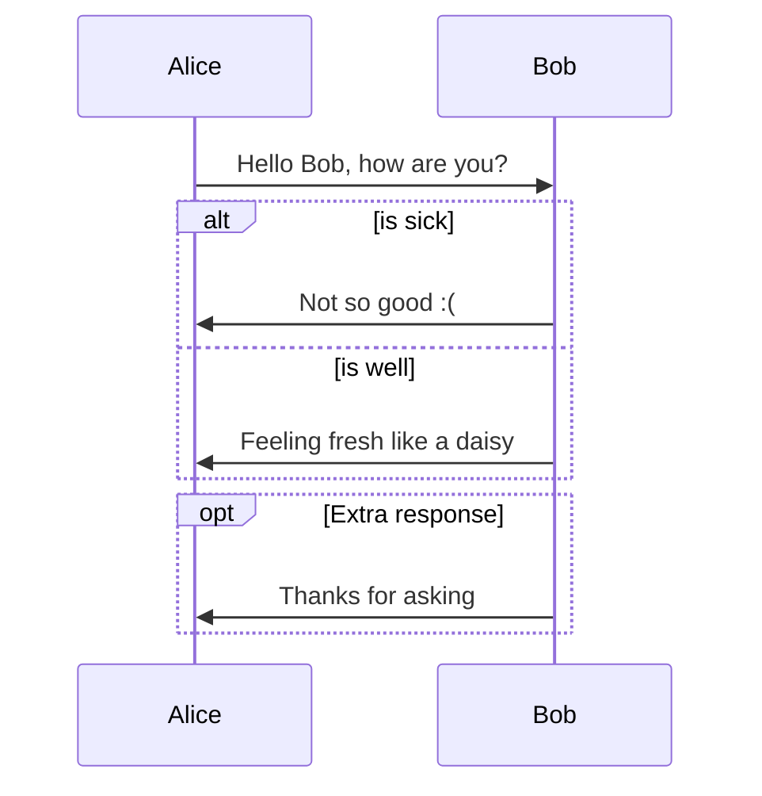
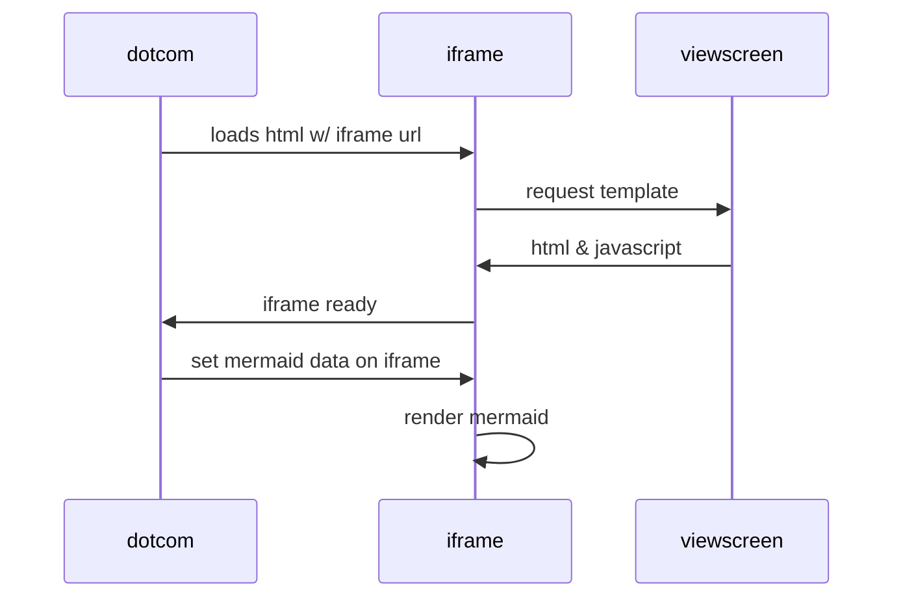

# mermaid-test
Tests Mermaid Markdown

see https://github.blog/2022-02-14-include-diagrams-markdown-files-mermaid/

see https://mermaid-js.github.io/mermaid/#/

see https://marketplace.visualstudio.com/items?itemName=bierner.markdown-mermaid

